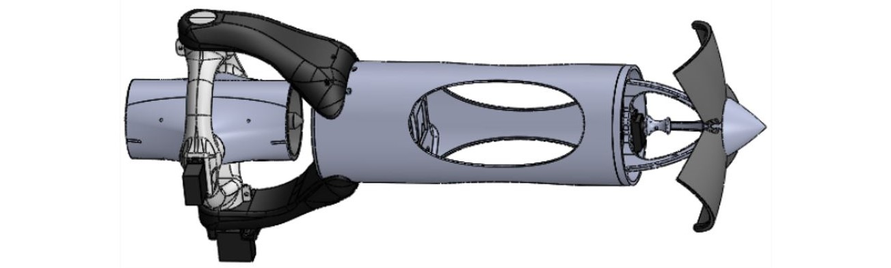
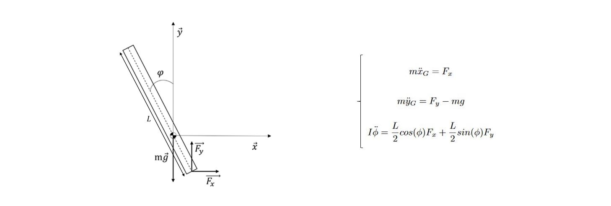
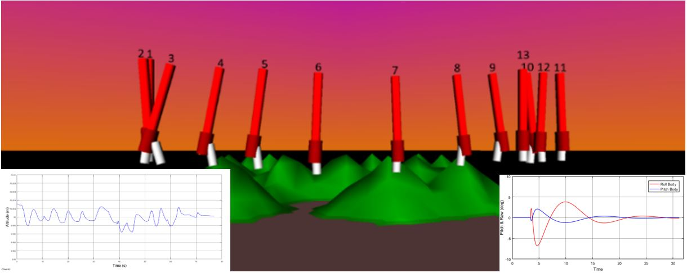
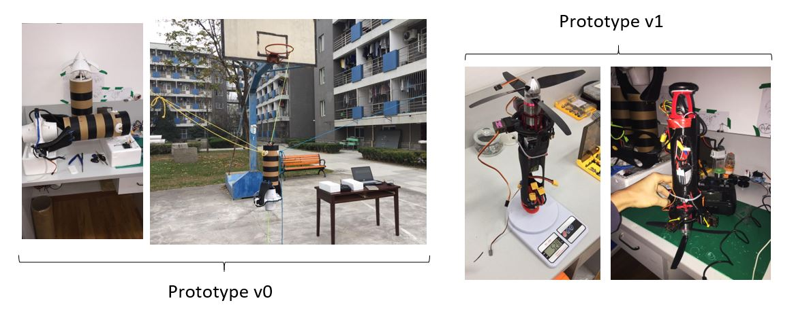

There is an increasing demand for fast drone deliveries for both consumer’s necessities and medical emergencies. In addition to improve delivery, there have been many developments within space research aiming to reduce global cost. Reusable rockets are regarded as the future of space travel, however, numerous accidents have been observed during landing, making these rockets an unreliable resource for experimentation. This new benchmark system is a reliable platform. It mainly embeds drone and model making components on an electric thrust vectored rocket architecture.

Under its state conditions and using Newton's laws, the equations of motion approximate an inverted pendulum.

It has then been simulated on MATLAB. It proves that a PID control loop allows the system to accurately takeoff, hover and land.

As a proof of concept, a real prototype is under development. It is now time to optimize flight-time and implement transition between hovering and standard flight.

