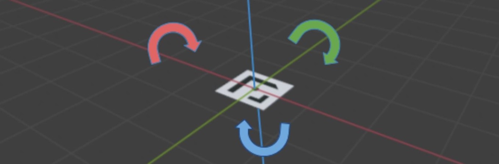
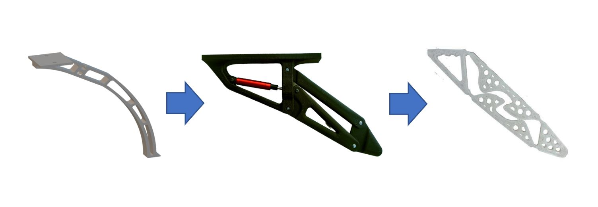

#### Drone Perception

This research proposed a way to generate accurate photorealistic dataset for a given landing pad. It was then possible to use it for supervised learning.

The proposed [dataset generator](https://github.com/jumellet/landing-pad-dataset-generator) gave a way to feed the neural networks. It has now the ability to estimate accurately its position with a wide range of vision. Thanks to an appropriate landing pad shape, even seeing only part of the landing area permits the drone to descend.

#### Guidance and Control

For visual servoing, a multi-scale control is proposed where control sensitivity depends on drone altitude. The use of the neural network in a simulated environment multiplied by three the processing rate, the control is thus closer to real time. 

#### Mechanical Landing Gear

For fast landing situations, the vertical speed is higher than standard descent. The research proposes a landing gears that absorbs more than ten times the kinetic energy of standard landing legs. A
**patent** is filed to protect the concept..

