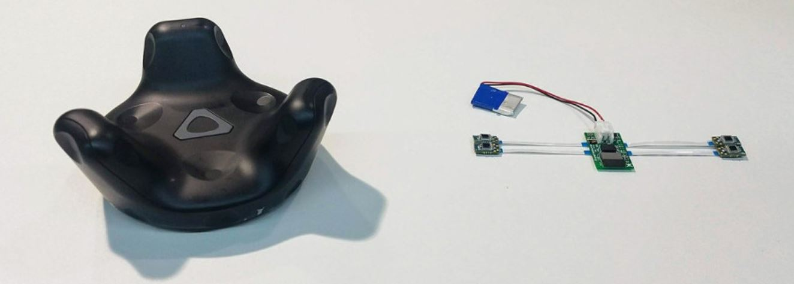

This Master project was about the miniaturization of the Vive Tracker developpd by HTC. It allows sub-millimetric 3d positioning at scale, and embeds a 9DoF IMU with sensor fusion. The <a href="https://github.com/HiveTracker">repository</a> shows several developments and documented test bricks.

During this project, I had first simulate the Hive Tracker on a <a href="https://github.com/jumellet/Kalman-Filter/tree/Dev/Simulations">game engine</a>.

I have then implemented the mathematical principle of the HTC Vive localisation. We wanted to publish it in open source, we used Blender for 3D virtual representation.

