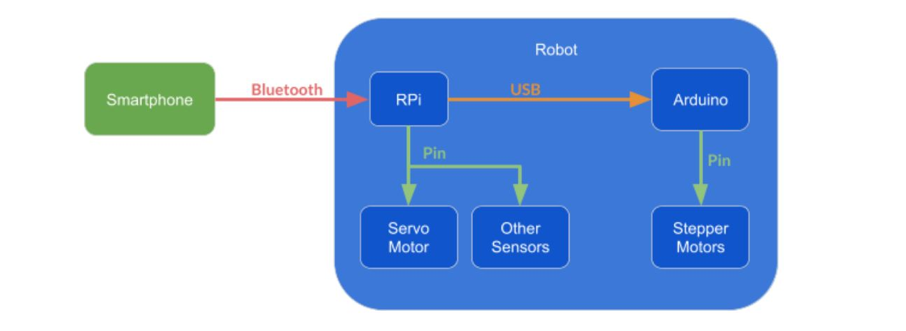
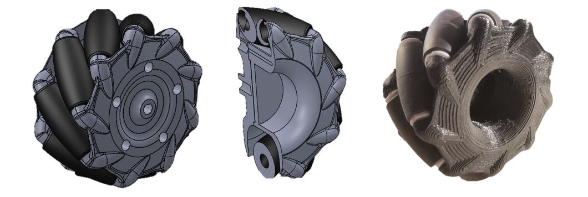
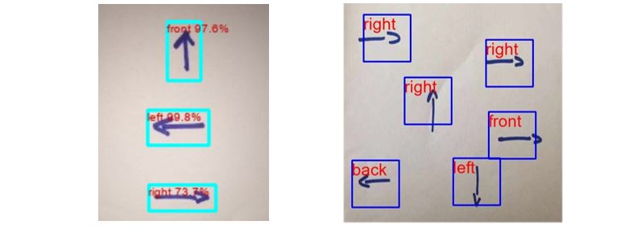

#### System Architecture

The robot embeds common and open source components to be easily made.

#### Mechanical Design

As the project aims to be open source, we try to make the robot fully 3D printable. [Here]("https://github.com/jumellet/ilo-bot/tree/main/parts") can be found the differnet parts.

#### Elementary Programming

It is now our goal to propose introduction of algorithms from the youngest age. We provide an easy way to learn how to structure computer code and execute it.

